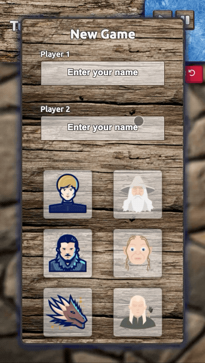

#  ✖️✖️✖️ Tic Tac Toe - Javascript

This project is part of a series of projects to be completed by students of [Microverse](https://www.microverse.org/).

This project focuses on creating a GoT vs LOTR themed tic tac toe app.

## 🧮 The Project Brief

The specifications and the guide to the project can be found The Odin Project's ['TicTacToe Project'](https://www.theodinproject.com/courses/javascript/lessons/tic-tac-toe-javascript) page.

The premise of this project is to use  javascript modules and factories  to create a TicTacToe app. Here the user will be able to create 2 players, select their names, choose a character, and play the game!

## 📽️ Previews

> Responsive Screen Sizes - Mobile

********

> Responsive Screen Sizes - Tablet

********

> Responsive Screen Sizes - Laptop

*********

## 🧬 Technologies & Languages Used

- Javascript
- ESLint
- StyleLint
- CSS/SASS
- Stickler CI

## 🔰 Setup & Usage

### Setup
To view the project in action, follow [this link to the live website](https://raw.githack.com/Rhelli/Javascript-Tic-Tac-Toe/feature/linters/index.html
) or download the repository and open the HTML file with your browser of choice (we'd recommend Chrome).

## 🛎️ Contributions, Issues & Forking

If you have any issues setting up the project or you come across any unintended bugs or problems, please do submit an issue to the [Book Library](https://github.com/Rhelli/Javascript-Tic-Tac-Toe/issues) page.

If you want to make your own changes, modifications or improvements to our project, go ahead and Fork it!
1. [Fork it](https://github.com/Rhelli/Javascript-Tic-Tac-Toe/fork)
2. Create your working branch (git checkout -b [choose-a-name])
3. Commit your changes (git commit -am 'what this commit will fix/add/improve')
4. Push to the branch (git push origin [chosen-name])
5. Create a new Pull Request

## 🤟🏽😄 😛🤙🏾  Creators

Alexis Sanchez - [Github](https://github.com/Psiale)

Rory Hellier - [GitHub](https://github.com/Rhelli)

## 🙌🏾 Show Your Support

Give a ⭐️ if you like this project!